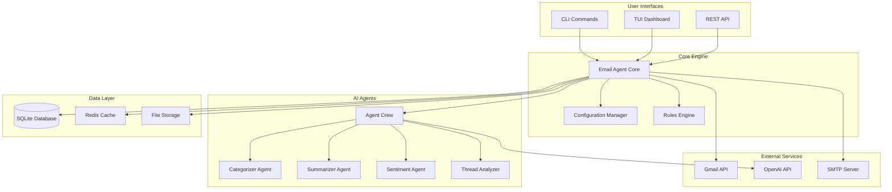
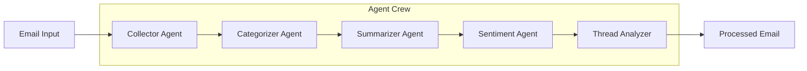
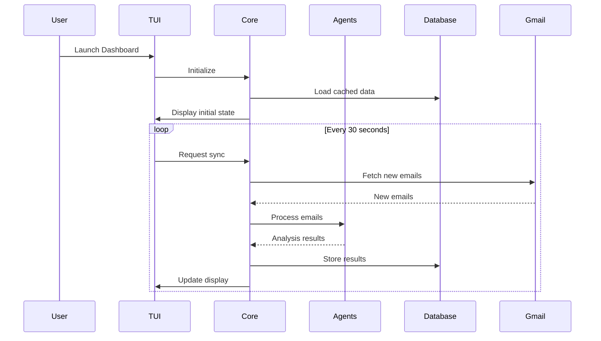

# System Architecture

The Email Agent is built with a modular, multi-agent architecture designed for scalability, maintainability, and extensibility.

## 🏗️ High-Level Architecture



## 📦 Component Overview

### 1. User Interfaces

#### CLI (Command Line Interface)
- **Location**: `src/email_agent/cli/`
- **Purpose**: Command-line operations and scripting
- **Framework**: Typer
- **Key Features**:
  - Email synchronization
  - Statistics generation
  - Configuration management
  - Rule management

#### TUI (Text User Interface)
- **Location**: `src/email_agent/tui/`
- **Purpose**: Interactive terminal dashboard
- **Framework**: Textual
- **Key Features**:
  - Real-time email monitoring
  - Interactive email management
  - Visual analytics
  - Multi-panel interface

### 2. Core Engine

#### Email Agent Core
- **Location**: `src/email_agent/`
- **Purpose**: Central orchestration and business logic
- **Responsibilities**:
  - Email processing coordination
  - Agent task distribution
  - Data flow management
  - Error handling and recovery

#### Configuration Manager
- **Location**: `src/email_agent/config.py`
- **Purpose**: Centralized configuration management
- **Features**:
  - Environment variable integration
  - YAML/JSON configuration files
  - Runtime configuration updates
  - Validation and defaults

#### Rules Engine
- **Location**: `src/email_agent/rules/`
- **Purpose**: Email processing rules and automation
- **Components**:
  - **Basic Engine**: Simple pattern matching
  - **Advanced Engine**: ML-powered rule generation
  - **Processors**: Rule execution and actions
  - **Built-in Rules**: Common email patterns

### 3. AI Agent System

#### Multi-Agent Architecture
The system uses CrewAI for coordinated AI agent operations:



#### Individual Agents

**Collector Agent**
- **Purpose**: Email data collection and preprocessing
- **Responsibilities**:
  - Gmail API integration
  - Email parsing and normalization
  - Attachment handling
  - Metadata extraction

**Categorizer Agent**
- **Purpose**: Email classification and routing
- **Model**: GPT-4 with custom prompts
- **Categories**:
  - Action Required
  - Informational
  - Personal
  - Work
  - Newsletters
  - Promotions

**Summarizer Agent**
- **Purpose**: Content summarization and key point extraction
- **Capabilities**:
  - Multi-language support
  - Context-aware summarization
  - Action item identification
  - Priority assessment

**Sentiment Analyzer**
- **Purpose**: Emotional tone and urgency detection
- **Outputs**:
  - Sentiment score (-1 to 1)
  - Urgency level (1-5)
  - Emotional context
  - Response suggestions

**Thread Analyzer**
- **Purpose**: Email thread context and relationship analysis
- **Features**:
  - Conversation tracking
  - Participant analysis
  - Topic evolution
  - Response patterns

### 4. Data Layer

#### Database Schema
```sql
-- Core email storage
CREATE TABLE emails (
    id TEXT PRIMARY KEY,
    gmail_id TEXT UNIQUE,
    thread_id TEXT,
    subject TEXT,
    sender TEXT,
    recipients TEXT,
    content TEXT,
    received_at TIMESTAMP,
    category TEXT,
    priority INTEGER,
    sentiment_score REAL,
    summary TEXT,
    created_at TIMESTAMP
);

-- Email threads
CREATE TABLE email_threads (
    id TEXT PRIMARY KEY,
    gmail_thread_id TEXT UNIQUE,
    subject TEXT,
    participants TEXT,
    message_count INTEGER,
    last_message_at TIMESTAMP,
    category TEXT,
    summary TEXT
);

-- Rules and automation
CREATE TABLE rules (
    id INTEGER PRIMARY KEY,
    name TEXT,
    conditions TEXT,
    actions TEXT,
    enabled BOOLEAN,
    created_at TIMESTAMP
);
```

#### Caching Strategy
- **Email Content**: LRU cache for recent emails
- **API Responses**: TTL cache for external API calls
- **Analysis Results**: Persistent cache for AI analysis
- **Configuration**: In-memory cache with file watching

### 5. External Integrations

#### Gmail API Integration
- **Authentication**: OAuth 2.0 flow
- **Scopes**: Read-only access to emails
- **Rate Limiting**: Exponential backoff
- **Batch Operations**: Efficient bulk processing

#### OpenAI API Integration
- **Models**: GPT-4, GPT-3.5-turbo
- **Token Management**: Optimization and monitoring
- **Error Handling**: Retry logic and fallbacks
- **Cost Optimization**: Prompt caching and batching

## 🔄 Data Flow

### Email Processing Pipeline

1. **Collection Phase**
   ```python
   Gmail API → Email Parser → Normalization → Database Storage
   ```

2. **Analysis Phase**
   ```python
   Email → Agent Crew → AI Processing → Results Aggregation
   ```

3. **Action Phase**
   ```python
   Results → Rules Engine → Automation Actions → Notifications
   ```

### Real-time Updates



## 🎯 Design Patterns

### 1. Agent Pattern
Each AI agent is self-contained with:
- Clear responsibilities
- Standardized interfaces
- Error handling
- Performance monitoring

### 2. Repository Pattern
Data access is abstracted through repositories:
```python
class EmailRepository:
    def save(self, email: Email) -> None
    def find_by_id(self, email_id: str) -> Email
    def find_by_criteria(self, criteria: dict) -> List[Email]
```

### 3. Command Pattern
CLI commands are implemented as discrete command objects:
```python
class SyncCommand(BaseCommand):
    def execute(self, args: SyncArgs) -> None
```

### 4. Observer Pattern
Components can subscribe to events:
```python
email_processor.on_email_processed.subscribe(update_dashboard)
```

## 🚀 Performance Considerations

### Concurrency
- **Async/Await**: Non-blocking I/O operations
- **Thread Pool**: CPU-intensive tasks
- **Process Pool**: AI model inference
- **Queue System**: Background job processing

### Caching
- **Multi-level Caching**: Memory → Disk → Network
- **Cache Invalidation**: Time-based and event-driven
- **Compression**: Email content and analysis results

### Database Optimization
- **Indexing**: Optimized queries for common operations
- **Partitioning**: Date-based email partitioning
- **Connection Pooling**: Efficient database connections
- **Migrations**: Schema versioning and updates

## 🔧 Extensibility

### Plugin System
```python
class EmailPlugin:
    def process_email(self, email: Email) -> EmailProcessingResult
    def get_metadata(self) -> PluginMetadata
```

### Custom Agents
```python
class CustomAgent(BaseAgent):
    def process(self, email: Email) -> AgentResult
    def configure(self, config: dict) -> None
```

### Rule Extensions
```python
class CustomRule(BaseRule):
    def matches(self, email: Email) -> bool
    def execute(self, email: Email) -> RuleResult
```

## 📊 Monitoring and Observability

### Metrics Collection
- **Email Processing**: Volume, latency, errors
- **AI Operations**: Token usage, response times
- **System Health**: Memory, CPU, disk usage
- **User Activity**: Command usage, interface interactions

### Logging Strategy
```python
# Structured logging with context
logger.info("Email processed", extra={
    "email_id": email.id,
    "category": result.category,
    "processing_time": elapsed_time,
    "agent_results": agent_results
})
```

### Error Tracking
- **Centralized Error Handling**: Consistent error processing
- **Error Classification**: Transient vs. permanent errors
- **Recovery Strategies**: Automatic retries and fallbacks
- **User Notifications**: Meaningful error messages

## 🔒 Security Architecture

### Authentication
- **OAuth 2.0**: Secure Gmail integration
- **Token Management**: Secure storage and rotation
- **API Key Protection**: Environment-based configuration

### Data Protection
- **Encryption at Rest**: Database encryption
- **Encryption in Transit**: TLS for all communications
- **PII Handling**: Anonymization and redaction
- **Access Control**: Role-based permissions

### Privacy Considerations
- **Local Processing**: AI analysis happens locally when possible
- **Data Minimization**: Only necessary data is stored
- **Retention Policies**: Automatic data cleanup
- **User Consent**: Clear privacy disclosures
